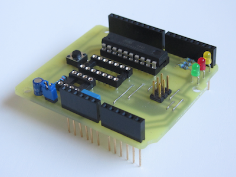
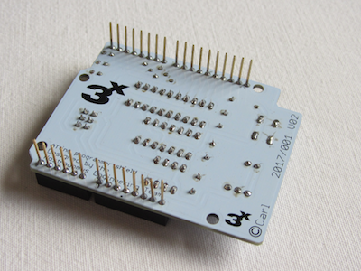
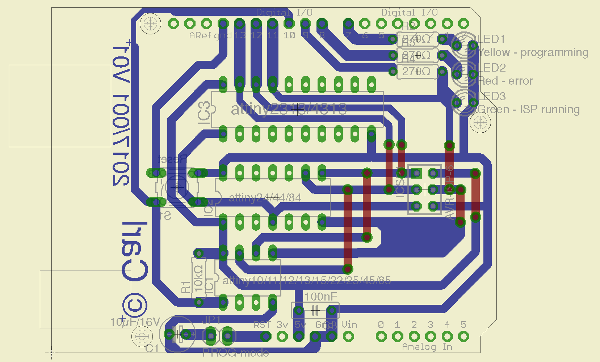
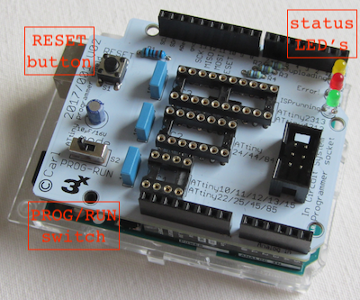
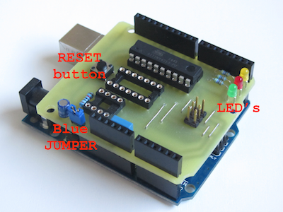
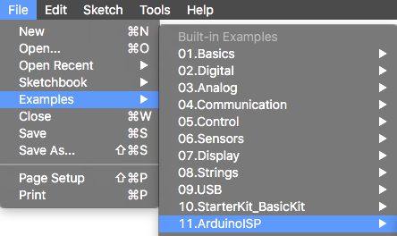
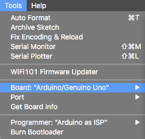
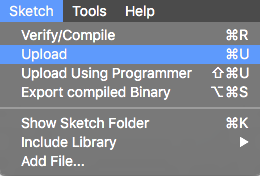
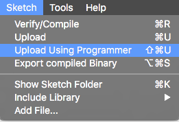

# ATtiny ISP programmer shield for Arduino UNO boards

## What

This repo provides you with all necessary info (and files) to build an Arduino shield to program Atmel's **attiny** 𝜇-controllers. For that matter, the underlying Arduino board should be loaded with the ISP-programmer sketch (built-in example).

 

## Why

Often, one of these "tiny" chips is largely powerful enough for the design of small projects. During the design phase, I however got tired of wiring up things on a breadboard. As (like many people) I was having a spare UNO, which could serve as an ISP programmer, I decided to design a minimalistic shield to fit on top of it.  

## How

The shield has been designed with EAGLE from AutoDesk/CadSoft. This shield [project](eagle-files/) can be opened with the free version [(download here)](http://www.autodesk.com/products/eagle/free-download). In order to keep things simple, the V1 PCB can be etched single-sided, as the top-layer only contains a couple of short connections (which can easily be replaced by wire-bridges). The V2 PCB (a real double-sided version) has optimised routing and ground-pours. Only [through-hole components](BOM.md) have been used in order to make the built also feasible for any beginner. In the [pdf-folder](pdf-files/) of this repo pdf versions of all important EAGLE views are available, for those not wanting to install EAGLE. Pay attention to print the bottom and top-layer layouts **without re-sizing** (1:1). To have the printed circuit board built by a commercial PCB-shop, the [gerber-files](gerber-files/) are also available. A series of V2 PCB's is still available in our workshop.

## Technical details

### What’s on the board

The board is fit with 3 IC sockets (8, 14 and 20 pin), for the 3 types attiny’s. **Only one chip should be fit at a time** :exclamation: On the prototype, pin headers with double functionality have been mounted. Pins on the bottom-side to fit on the Arduino board, and feed-through female headers on the top for easy access of all Arduino connections.
The push button, is connected to the reset lines of the attiny’s with a 10kΩ pull-up resistor. When the shield is cut correctly, the reset button for the Arduino UNO itself should still be accessible. In order to make the Arduino Uno work as an ISP programmer a 10µF capacitor needs to be connected on its reset-line.
Three LED’s are available to visualise the correct functionality of the programming procedure.
An optional AVR ISP socket has been foreseen in order to use the shield as stand-alone with a commercial programmer.

 

#### BOM - bill of materials

Part | Value | Package | Description  
---- | ----- | ------- | -----------                            
R1     | 10kΩ           | 0207/7         | resistor                                            
R2,3,4 | 270Ω           | 0207/7         | resistor                                            
C1     | 10µF/16V       | E2,5-6E        | polarized capacitor                                 
C2,3,4 | 100nF          | C050-025X075   | capacitor                                           
LED1   | 3mm yellow     | 3mm            | LED                              
LED2   | 3mm red        | 3mm            | LED                              
LED3   | 3mm green      | 3mm            | LED                                                                                             
IC1    | 8-pin          | DIL08          | IC socket                                                            
IC2    | 14-pin         | DIL14          | IC socket                                                                     
IC3    | 20-pin         | DIL20          | IC socket                                                                     
ICSP1  | 2x3 pin-header | 2x3            | AVR ISP-6 Serial Programming Header (optional)                                 
S1     | momentary      | 6x6x6mm        | momentary tact push button
S2	   | SPDT	          | MINI SWITCH 90 | mini toggle switch
CON1,2 | 6-pin          | SIL06          | long needle female stackable pin header strip
CON3   | 8-pin          | SIL08          | long needle female stackable pin header strip
CON4   | 10-pin         | SIL10          | long needle female stackable pin header strip

### How things work

First the the [ISP-programmer sketch](sketches/ArduinoISP.ino) (built-in example) should be loaded to the Arduino UNO board. During that operation, switch S2 should be set to 'PROG' (or remove the blue jumper JP1 on a V1 board). Select “Arduino Uno” as target board in the tools-menu. Load the ISP-programmer sketch with the “UPLOAD” button. Once loaded, the jumper can be put back to send your a sketch to your attiny 𝜇-controller.

  

To load a sketch to your attiny chip, make sure that the correct target board is selected in the tools-menu (you might need to download a specific library -> tools-menu, board manager). This time, use the “UPLOAD USING PROGRAMMER” option from the sketch-menu.

 

The 3 LED’s will tell you how things are going :
 - Green  : ISP programmer running
 - Yellow : uploading sketch
 - Red    : error  

### Proof of concept

So far, I have tested the shield with the below list of 𝜇-controllers :
 - attiny84
 - attiny85
 - attiny2313
 - attiny4313

 Any pin-compatible 𝜇-controller should work as well :
 - 8-pin  : attiny10/11/12/13/15/22/25/45/85
 - 14-pin : attiny24/44/84
 - 20-pin : attiny2313/4313
 (on condition of using the correct settings in your Arduino programming environment)

## Contributors

If you are having any good suggestions, just drop me a line [:email:](http://nostradomus.ddns.net/contactform.html).
If feasible, I'll be happy to implement proposed improvements.
And if you are having lots of time, I'll be happy to share the work with you ;-).

## :globe_with_meridians: License

At this moment, there is no specific license attached to this project.

So, today, if you like it, have fun with it (at your own risk of course :-D), and especially, be creative.

Oh, and when using anything from this repository, it is highly appreciated if you mention its origin.

If you would like to use any of this work (or the whole project) for commercial use, first [contact us :email:](http://nostradomus.ddns.net/contactform.html), so we can add the appropriate license, which best fits your business.
